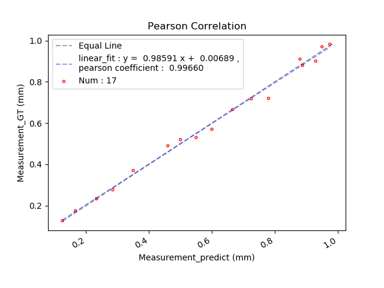
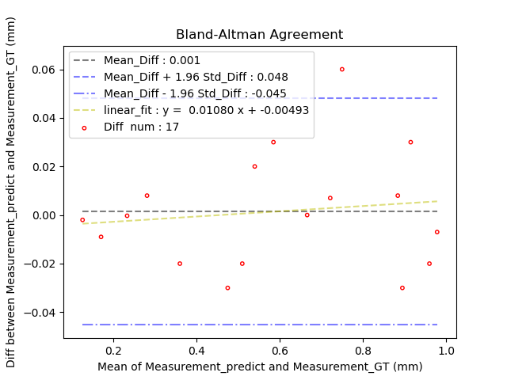

<!--
 * @Author: Shuangchi He / Yulv
 * @Email: yulvchi@qq.com
 * @Date: 2022-02-08 23:33:52
 * @Motto: Entities should not be multiplied unnecessarily.
 * @LastEditors: Shuangchi He
 * @LastEditTime: 2022-02-11 23:44:36
 * @FilePath: /Correlation_and_Agreement_Analysis/README.md
 * @Description: repo. https://github.com/Yulv-git/Correlation_and_Agreement_Analysis
-->

# Statistical Analysis for Correlation and Agreement

Assessing correlation and agreement between two methods of measurement.

* Python

``` bash
python ./Python/Correlation_Agreement.py \
    --M_predict 0.125 0.95 0.55 0.60 0.78 0.46 0.88 0.50 0.93 0.35 0.975 0.725 0.285 0.166 0.666 0.888 0.233 \
    --M_GT 0.127 0.97 0.53 0.57 0.72 0.49 0.91 0.52 0.90 0.37 0.982 0.718 0.277 0.175 0.666 0.88 0.2333
```

* Matlab

``` bash
cd ./Matlab
plot_Pearson_Correlation_Bland_Altman_Agreement([0.125, 0.95, 0.55, 0.60, 0.78, 0.46, 0.88, 0.50, 0.93, 0.35, 0.975, 0.725, 0.285, 0.166, 0.666, 0.888, 0.233], [0.127, 0.97, 0.53, 0.57, 0.72, 0.49, 0.91, 0.52, 0.90, 0.37, 0.982, 0.718, 0.277, 0.175, 0.666, 0.88, 0.2333])
```

## Correlation

The correlation (Pearson Correlation) test can be used to statistically test the degree of correlation between the measured values of the same object through two measurement methods.



Measurement_predict and Measurement_GT have a high correlation (Pearson correlation coefficient of 0.9966).

## Agreement

Agreement (Bland-Altman Agreement) test is a measure of the mean and variance of the measurement values of the same object by two measurement methods.



Assuming that the difference between Measurement_predict and Measurement_GT conforms to a normal distribution, the difference between the two measurement methods is distributed within a confidence interval of 0.001±0.047 (mm) with 95% confidence. That is, it can be considered that the two measurement methods, Measurement_predict and Measurement_GT, have good Agreement.
