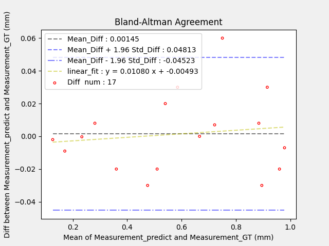

<!--
 * @Author: Shuangchi He / Yulv
 * @Email: yulvchi@qq.com
 * @Date: 2022-02-08 23:33:52
 * @Motto: Entities should not be multiplied unnecessarily.
 * @LastEditors: Shuangchi He
 * @LastEditTime: 2022-02-11 18:08:27
 * @FilePath: /Correlation_and_Agreement_Analysis/README.md
 * @Description: Init from https://github.com/Yulv-git/Correlation_and_Agreement_Analysisc
-->

# Statistical Analysis for Correlation and Agreement

Assessing correlation and agreement between two methods of measurement.

``` bash
python ./Python/Correlation_Agreement.py
```

## Correlation

The correlation (Pearson Correlation) test can be used to statistically test the degree of correlation between the measured values of the same object through two measurement methods.


Measurement_predict and Measurement_GT have a high correlation (Pearson correlation coefficient of 0.9966).

## Agreement

Agreement (Bland-Altman Agreement) test is a measure of the mean and variance of the measurement values of the same object by two measurement methods.



Assuming that the difference between Measurement_predict and Measurement_GT conforms to a normal distribution, the difference between the two measurement methods is distributed within a confidence interval of 0.001±0.045 (mm) with 95% confidence. That is, it can be considered that the two measurement methods, Measurement_predict and Measurement_GT, have good Agreement.
